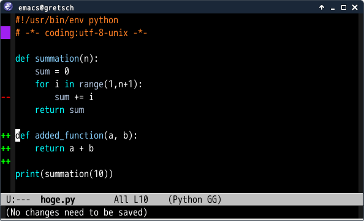
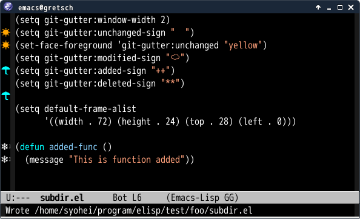
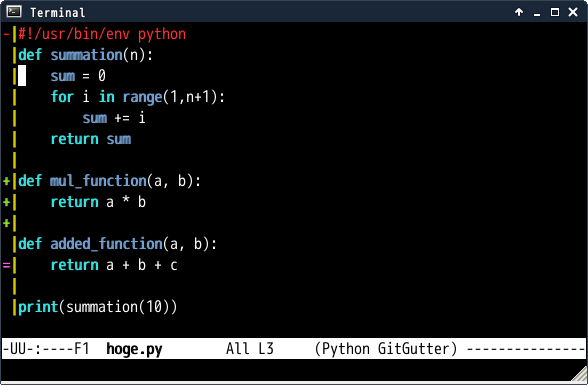

# git-gutter.el

## Introduction
`git-gutter.el` is port of [GitGutter](https://github.com/jisaacks/GitGutter)
which is a plugin of Sublime Text.


`git-gutter.el` also supports TRAMP so you can use `git-gutter.el` for remote files.


## Screenshot


## Requirements

* Emacs 23 or higher
* [Git](http://git-scm.com/) 1.7.0 or higher


## git-gutter.el vs [git-gutter-fringe.el](https://github.com/syohex/emacs-git-gutter-fringe)

### git-gutter.el

* Work in tty frame
* Not work with `linum-mode`
* More configurable

### git-gutter-fringe.el

* Not Work in tty frame
* Work with `linum-mode`
* Less configurable
* Show diff information on right side


## Installation

You can install `git-gutter.el` from [MELPA](https://github.com/milkypostman/melpa.git) with package.el
(`M-x package-install git-gutter`).

And you can also install it with [el-get](https://github.com/dimitri/el-get).


## Global Minor Mode and Minor Mode

`git-gutter.el` provides global minor-mode(`global-git-gutter-mode`) and minor-mode(`git-gutter-mode`).

If you want to use `git-gutter` for files in git repository.
You add following s-exp in your configuration file(`~/.emacs.d/init.el` or `~/.emacs`).

````elisp
(global-git-gutter-mode t)
````

Other case, you want to use `git-gutter` for some files, you can use `git-gutter-mode`.
Following example of enabling `git-gutter` for some mode.

````elisp
(add-hook 'ruby-mode-hook 'git-gutter-mode)
(add-hook 'python-mode-hook 'git-gutter-mode)
````


## Basic Usage

`git-gutter.el` provides following commands.

Show changes from last commit or Update change information.

    M-x git-gutter

Clear changes

    M-x git-gutter:clear

Toggle git-gutter

    M-x git-gutter:toggle

Jump to next hunk(alias `git-gutter:next-diff`)

    M-x git-gutter:next-hunk

Jump to previous hunk(alias `git-gutter:previous-diff`)

    M-x git-gutter:previous-hunk

Popup current diff hunk

    M-x git-gutter:popup-hunk(alias `git-gutter:popup-diff`)

`git-gutter:next-hunk` and `git-gutter:previous-hunk` update content
of buffer popuped by `git-gutter:popup-diff` to current hunk.

Revert current hunk

    M-x git-gutter:revert-hunk


## Sample Configuration

````elisp
(require 'git-gutter)

;; If you enable global minor mode
(global-git-gutter-mode t)

;; If you enable git-gutter-mode for some modes
(add-hook 'ruby-mode-hook 'git-gutter-mode)

(global-set-key (kbd "C-x C-g") 'git-gutter:toggle)
(global-set-key (kbd "C-x v =") 'git-gutter:popup-hunk)

;; Jump to next/previous hunk
(global-set-key (kbd "C-x p") 'git-gutter:previous-hunk)
(global-set-key (kbd "C-x n") 'git-gutter:next-hunk)

;; Revert current hunk
(global-set-key (kbd "C-x r") 'git-gutter:revert-hunk)
````


## Customize

### Look and feel



You can change the signs and those faces.

````elisp
(setq git-gutter:modified-sign "  ") ;; two space
(setq git-gutter:added-sign "++")    ;; multiple character is OK
(setq git-gutter:deleted-sign "--")

(set-face-background 'git-gutter:modified "purple") ;; background color
(set-face-foreground 'git-gutter:added "green")
(set-face-foreground 'git-gutter:deleted "red")
````

You can change minor-mode name in mode-line to set `git-gutter:lighter`.
Default is " GitGutter"

````elisp
;; first character should be a space
(setq git-gutter:lighter " GG")
````


### Using full width characters



Emacs has `char-width` function which returns character width.
`git-gutter.el` uses it for calculating character length of the signs.
But `char-width` does not work for some full-width characters.
So you should explicitly specify window width, if you use full-width
character.

```` elisp
(setq git-gutter:window-width 2)
(setq git-gutter:modified-sign "☁")
(setq git-gutter:added-sign "☀")
(setq git-gutter:deleted-sign "☂")
````

### If You Feel git-gutter is Slow

`git-gutter.el` updates gutter at hooks below

* `after-save-hook`
* `after-revert-hook`
* `window-configuration-change-hook`

`window-configuration-change-hook` is run N times if you show N windows,
so you may feel git-gutter is slow if you show many windows.

In such case, please remove `window-configuration-change-hook` to update points
as below and instead you update `M-x git-gutter` manually when needed.

````
(setq git-gutter:update-hooks '(after-save-hook after-revert-hook))
````

You can also add other hook points by setting `git-gutter:update-hooks`.


### Show Unchanged Information


`git-gutter.el` can view unchanged information by setting `git-gutter:unchanged-sign`.
Like following.

````elisp
(setq git-gutter:unchanged-sign " ")
(set-face-background 'git-gutter:unchanged "yellow")
````

Default value of `git-gutter:unchanged-sign` is `nil`.

### Show a separator column



`git-gutter.el` can display an additional separator character at the right of the changed
signs. This is mostly useful when running emacs in a console.

````elisp
(setq git-gutter:separator-sign "|")
(set-face-foreground 'git-gutter:separator "yellow")
````

Default value of `git-gutter:separator-sign` is `nil`.

### Hide gutter if there are no changes

Hide gutter when there are no changes if `git-gutter:hide-gutter` is non-nil.
(Default is nil)

````elisp
(setq git-gutter:hide-gutter t)
````

### Pass option to 'git diff' command

You can pass `git diff` option to set `git-gutter:diff-option`.

````elisp
;; ignore all spaces
(setq git-gutter:diff-option "-w")
````


### Run hook

Run hook `git-gutter-mode-on-hook` when `git-gutter-mode` is turn on, and
run hook `git-gutter-mode-off-hook` when `git-gutter-mode` is turn off.


## See Also

### [GitGutter](https://github.com/jisaacks/GitGutter)

GitGutter is Sublime Text plugin.

### [diff-hl](https://github.com/dgutov/diff-hl)

`diff-hl` has more features than `git-gutter.el`.

### [vim-gitgutter](https://github.com/airblade/vim-gitgutter)

Vim version of GitGutter

### Another implementation of git-gutter.el

[How to write another implementation](wiki/Write-another-git-gutter.el-implementation)
