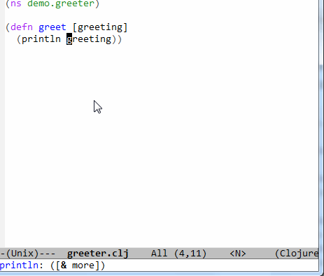

[](http://melpa.org/#/clj-refactor)
[](http://stable.melpa.org/#/clj-refactor)
[](http://travis-ci.org/clojure-emacs/clj-refactor.el)
[](https://gitter.im/clojure-emacs/refactor-nrepl?utm_source=badge&utm_medium=badge&utm_campaign=pr-badge)

# clj-refactor.el

`clj-refactor` provides refactoring support for Clojure projects.

Here's a small teaser, helping you add a missing libspec:



## Installation

It's highly recommended to install `clj-refactor` through `package.el`.

It's available on [MELPA](http://melpa.org/) and [MELPA Stable](http://stable.melpa.org/):

    M-x package-install clj-refactor

## Setup

```el
(require 'clj-refactor)

(defun my-clojure-mode-hook ()
    (clj-refactor-mode 1)
    (yas-minor-mode 1) ; for adding require/use/import statements
    ;; This choice of keybinding leaves cider-macroexpand-1 unbound
    (cljr-add-keybindings-with-prefix "C-c C-m"))

(add-hook 'clojure-mode-hook #'my-clojure-mode-hook)
```

The more advanced refactorings require our nREPL middleware
[refactor-nrepl](https://github.com/clojure-emacs/refactor-nrepl). From
version *2.2.0* onwards if `cider-jack-in` is used it is injected
automatically.

**`profiles.clj` or `profile.boot` don't need to be modified anymore for the above usecase!**

On the other hand if a standalone REPL or an embedded nREPL server is
used you will need to manually add this dependency (see below).

Either in your project's `project.clj` or in the `:user`
profile found at `~/.lein/profiles.clj`:

```clojure
:plugins [[refactor-nrepl "2.2.0"]
          [cider/cider-nrepl "0.11.0"]]
```

Check out the much longer
[installation](https://github.com/clojure-emacs/clj-refactor.el/wiki/installation)
page in the wiki for a less opinionated approach.

`clj-refactor` has quite a few settings you can tweak to change the
behavior of various commands.  You can read more about that
[here](https://github.com/clojure-emacs/clj-refactor.el/wiki#customization).

### In case `refactor-nrepl` used for advanced refactorings

The [analyzer](https://github.com/clojure/tools.analyzer)
`refactor-nrepl` uses needs to eval the code too in order to be able
to build the AST we can work with. If that causes side effects like
writing files, opening connections to servers, modifying databases,
etc. performing certain refactoring functions on your code will do
that, too.

By default the user is warned about this when an AST dependent feature
is invoked. If this warning is an annoyance and the project can be
evalled without any risks set `cljr-warn-on-eval` to nil so
`cljr-eagerly-build-asts-on-startup` can take effect.

We create ASTs for all the namespaces at REPL start up if
`cljr-warn-on-eval` is set to nil. If that is not desired set
`cljr-eagerly-build-asts-on-startup` to `nil` in your emacs
configuration. AST dependent features at the moment are `find usages`,
`rename symbol`, `extract function`, `inline symbol`, `rename file or
dir`, `change function signature`, `promote function`.

## Usage

All functions in `clj-refactor` have a two-letter mnemonic
shortcut. E.g. `rs` for `cljr-rename-symbol`.  Given the prefix choice
in the example setup you'd call this function by hitting `C-c C-m rs`

See the wiki for a complete [list of available refactorings]
(https://github.com/clojure-emacs/clj-refactor.el/wiki),
demonstrations and customization points.

If you're having trouble remembering the mnemonic shortcuts, check out
the [hydra](https://github.com/abo-abo/hydra) powered popup menus.
They are described
[here](https://github.com/clojure-emacs/clj-refactor.el/wiki/Hydra).

## Changelog

An extensive changelog is available [here](CHANGELOG.md).

## Contribute

Yes, please do. There's a suite of tests, so remember to add tests for
your specific feature, or we might break it later.

You'll find the repo at:

    https://github.com/clojure-emacs/clj-refactor.el

To fetch the test dependencies, install
[cask](https://github.com/cask/cask) if you haven't already,
then:

    $ cd /path/to/clj-refactor
    $ cask

Run the tests with:

    $ ./run-tests.sh


Before submitting a patch, or a pull request, make sure all tests are
passing and that your patch is in line with the [contribution
guidelines](.github/CONTRIBUTING.md).

Thanks to [everyone](https://github.com/clojure-emacs/clj-refactor.el/graphs/contributors) who's contributed so far!

## License

Copyright © 2012-2016 Magnar Sveen
Copyright © 2014-2016 Magnar Sveen, Lars Andersen, Benedek Fazekas

Author: Magnar Sveen <magnars@gmail.com>
        Lars Andersen <expez@expez.com>
        Benedek Fazekas
Keywords: convenience, clojure, cider

This program is free software; you can redistribute it and/or modify
it under the terms of the GNU General Public License as published by
the Free Software Foundation, either version 3 of the License, or
(at your option) any later version.

This program is distributed in the hope that it will be useful,
but WITHOUT ANY WARRANTY; without even the implied warranty of
MERCHANTABILITY or FITNESS FOR A PARTICULAR PURPOSE.  See the
GNU General Public License for more details.

You should have received a copy of the GNU General Public License
along with this program.  If not, see <http://www.gnu.org/licenses/>.
