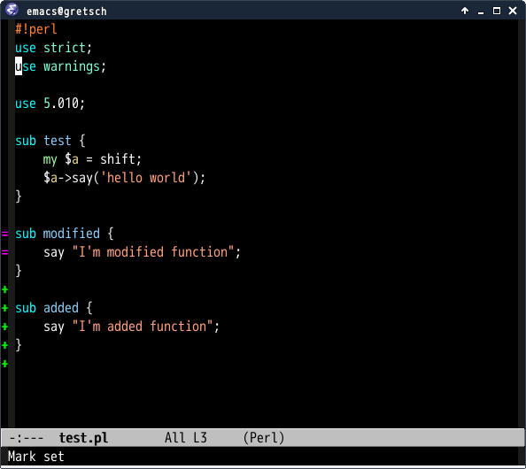
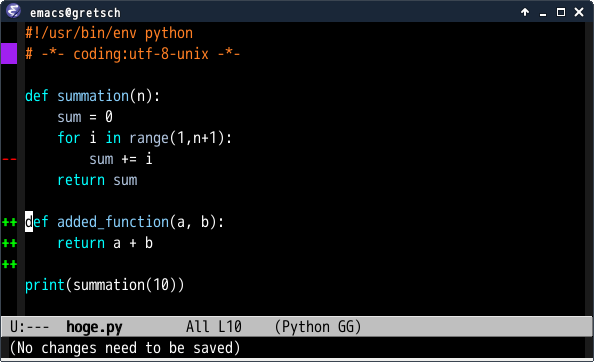
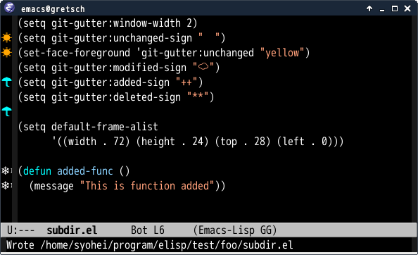
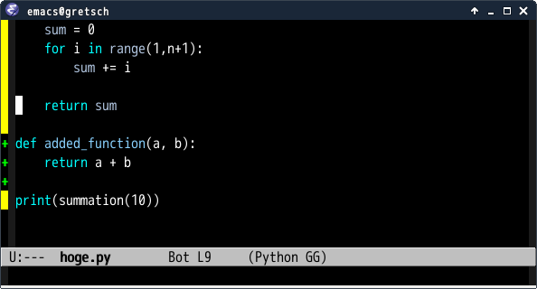
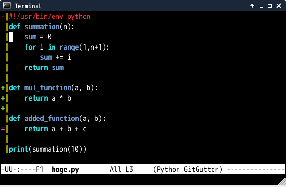

# git-gutter.el [![travis badge][travis-badge]][travis-link] [![melpa badge][melpa-badge]][melpa-link] [![melpa stable badge][melpa-stable-badge]][melpa-stable-link]

## Introduction

`git-gutter.el` is port of [GitGutter](https://github.com/jisaacks/GitGutter)
which is a plugin of Sublime Text.


## Features

- Asynchronous updating
- [Live updating](#live-updating)
- [Support multiple VCS](#backends)
- Support Tramp
- Work without `vc-mode`


## Screenshot




## Requirements

* Emacs 24 or higher
* [Git](http://git-scm.com/)(1.7.0 or higher)


## git-gutter.el vs [git-gutter-fringe.el](https://github.com/syohex/emacs-git-gutter-fringe)

|                      | git-gutter.el   | git-gutter-fringe.el |
|:---------------------|:---------------:|:--------------------:|
| Work in tty frame    | OK              | NG                   |
| Work with linum-mode | OK(experimental)| OK                   |
| Show on right side   | NG              | OK                   |
| More configurable    | OK              | NG                   |


## Installation

You can install `git-gutter.el` from [MELPA](http://melpa.org) with package.el
(`M-x package-install git-gutter`).

And you can also install it with [el-get](https://github.com/dimitri/el-get).


## Global Minor Mode and Minor Mode

`git-gutter.el` provides global minor-mode(`global-git-gutter-mode`) and minor-mode(`git-gutter-mode`).

If you want to use `git-gutter` for files in git repository.
You add following s-exp in your configuration file(`~/.emacs.d/init.el` or `~/.emacs`).

```lisp
(global-git-gutter-mode +1)
```

Other case, you want to use `git-gutter` for some files, you can use `git-gutter-mode`.
Following example of enabling `git-gutter` for some mode.

```lisp
(add-hook 'ruby-mode-hook 'git-gutter-mode)
(add-hook 'python-mode-hook 'git-gutter-mode)
```

## Commands

`git-gutter.el` provides following commands.
**Obsoleted interfaces will be removed when 1.0 released.**

#### `git-gutter:next-hunk`

Jump to next hunk

#### `git-gutter:previous-hunk`

Jump to previous hunk

#### `git-gutter:end-of-hunk`

Move to end of current hunk

#### `git-gutter:mark-hunk`

Mark current hunk.

#### `git-gutter:set-start-revision`

Set start revision where got diff(`git diff`, `hg diff` or `bzr diff`) from.

#### `git-gutter:popup-hunk`

Popup current diff hunk(alias `git-gutter:popup-diff`)

`git-gutter:next-hunk` and `git-gutter:previous-hunk` update content
of buffer popuped by `git-gutter:popup-diff` to current hunk.

#### `git-gutter:stage-hunk`

Stage current hunk. You can use this command like `git add -p`.
This command is supported only for `git`.

#### `git-gutter:revert-hunk`

Revert current hunk

#### `git-gutter`

Show changes from last commit or Update change information.
Please execute this command if diff information is not be updated.

#### `git-gutter:linum-setup`

Setup for working with `linum-mode`.

#### `git-gutter:update-all-windows`

Update git-gutter information of buffers in all visible window.


## Sample Configuration

```lisp
(require 'git-gutter)

;; If you enable global minor mode
(global-git-gutter-mode t)

;; If you would like to use git-gutter.el and linum-mode
(git-gutter:linum-setup)

;; If you enable git-gutter-mode for some modes
(add-hook 'ruby-mode-hook 'git-gutter-mode)

(global-set-key (kbd "C-x C-g") 'git-gutter)
(global-set-key (kbd "C-x v =") 'git-gutter:popup-hunk)

;; Jump to next/previous hunk
(global-set-key (kbd "C-x p") 'git-gutter:previous-hunk)
(global-set-key (kbd "C-x n") 'git-gutter:next-hunk)

;; Stage current hunk
(global-set-key (kbd "C-x v s") 'git-gutter:stage-hunk)

;; Revert current hunk
(global-set-key (kbd "C-x v r") 'git-gutter:revert-hunk)

;; Mark current hunk
(global-set-key (kbd "C-x v SPC") #'git-gutter:mark-hunk)
```


## Customize

### Live updating

If you set `git-gutter:update-interval` seconds larger than 0, `git-gutter` updates
diff information in real-time by idle timer.

```lisp
(custom-set-variables
 '(git-gutter:update-interval 2))
```

You can stop timer by `git-gutter:cancel-update-timer` and starts by `git-gutter:start-update-timer`.

### Look and feel



You can change the signs and those faces.

```lisp
(custom-set-variables
 '(git-gutter:modified-sign "  ") ;; two space
 '(git-gutter:added-sign "++")    ;; multiple character is OK
 '(git-gutter:deleted-sign "--"))

(set-face-background 'git-gutter:modified "purple") ;; background color
(set-face-foreground 'git-gutter:added "green")
(set-face-foreground 'git-gutter:deleted "red")
```

You can change minor-mode name in mode-line to set `git-gutter:lighter`.
Default is " GitGutter"

```lisp
;; first character should be a space
(custom-set-variables
 '(git-gutter:lighter " GG"))
```


### Using full width characters



Emacs has `char-width` function which returns character width.
`git-gutter.el` uses it for calculating character length of the signs.
But `char-width` does not work for some full-width characters.
So you should explicitly specify window width, if you use full-width
character.

```lisp
(custom-set-variables
 '(git-gutter:window-width 2)
 '(git-gutter:modified-sign "☁")
 '(git-gutter:added-sign "☀")
 '(git-gutter:deleted-sign "☂"))
```

### Backends

`git-gutter.el` supports following version control systems

- [Git](http://git-scm.com/)(1.7.0 or higher)
- [Mercurial](https://www.mercurial-scm.org/)
- [Subversion](https://subversion.apache.org/)(1.8 or higher)
- [Bazaar](http://bazaar.canonical.com/en/)


You can set backends which `git-gutter.el` will be used.
Default value of `git-gutter:handled-backends` is `'(git)`. If you want to use
`git-gutter.el` for other VCS, please change value of `git-gutter:handled-backends` as below.

```lisp
;; Use for 'Git'(`git`), 'Mercurial'(`hg`), 'Bazaar'(`bzr`), and 'Subversion'(`svn`) projects
(custom-set-variables
 '(git-gutter:handled-backends '(git hg bzr svn)))
```

### Updates hooks

diff information is updated at hooks in `git-gutter:update-hooks`.

```lisp
(add-to-list 'git-gutter:update-hooks 'focus-in-hook)
```

### Updates commands

diff information is updated after command in `git-gutter:update-commands` executed.

```lisp
(add-to-list 'git-gutter:update-commands 'other-window)
```

### Disabled modes

If you use `global-git-gutter-mode`, you may want some modes to disable
`git-gutter-mode`. You can make it by setting `git-gutter:disabled-modes`
to `non-nil`.

```lisp
;; inactivate git-gutter-mode in asm-mode and image-mode
(custom-set-variables
 '(git-gutter:disabled-modes '(asm-mode image-mode)))
```

Default is `nil`.

### Show signs at gutter by visual lines

Emacs folds long line if `truncate-lines` is `nil`. If `git-gutter:visual-line` is
non-nil, `git-gutter` puts sign by visual lines.

```lisp
(custom-set-variables
 '(git-gutter:visual-line t))
```

Default bahavior is that signs are put by logical lines.
value of `git-gutter:visual-line` is `nil`.

### Show Unchanged Information



`git-gutter.el` can view unchanged information by setting `git-gutter:unchanged-sign`.
Like following.

```lisp
(custom-set-variables
 '(git-gutter:unchanged-sign " "))
(set-face-background 'git-gutter:unchanged "yellow")
```

Default value of `git-gutter:unchanged-sign` is `nil`.

### Show a separator column



`git-gutter.el` can display an additional separator character at the right of the changed
signs. This is mostly useful when running emacs in a console.

```lisp
(custom-set-variables
 '(git-gutter:separator-sign "|"))
(set-face-foreground 'git-gutter:separator "yellow")
```

Default value of `git-gutter:separator-sign` is `nil`.

Please set `git-gutter:always-show-separator` to non-nil, if you want to show
separator always.

### Hide gutter if there are no changes

Hide gutter when there are no changes if `git-gutter:hide-gutter` is non-nil.
(Default is nil)

```lisp
(custom-set-variables
 '(git-gutter:hide-gutter t))
```

### Pass option to 'git diff' command

You can pass `git diff` option to set `git-gutter:diff-option`.

```lisp
;; ignore all spaces
(custom-set-variables
 '(git-gutter:diff-option "-w"))
```

### Don't ask whether commit/revert or not

`git-gutter.el` always asks you whether commit/revert or not. If you don't want,
please set `git-gutter:ask-p` to `nil`.

```lisp
;; Don't ask me!!
(custom-set-variables
 '(git-gutter:ask-p nil))
```

### Log/Message Level

```lisp
;; Don't need log/message.
(custom-set-variables
 '(git-gutter:verbosity 0))
```

Default value is 4(`0` is lowest, `4` is highest).

### Run hook

Run hook `git-gutter-mode-on-hook` when `git-gutter-mode` is turn on, and
run hook `git-gutter-mode-off-hook` when `git-gutter-mode` is turn off.

## Statistic

`git-gutter.el` provides some statistic API. This is useful for knowing how much
code you changed etc. To display them in mode-line is also useful.

#### `(git-gutter:buffer-hunks)`

Cound unstaged hunks in current buffer.

#### `(git-gutter:all-hunks)`

Cound unstaged hunks in all buffers

#### `(git-gutter:statistic)`

Return statistic unstaged hunks in current buffer. Return value is dot-list.
First element is total added lines, second element is total deleted lines.

## See Also

### [GitGutter](https://github.com/jisaacks/GitGutter)

GitGutter is Sublime Text plugin.

### [vim-gitgutter](https://github.com/airblade/vim-gitgutter)

Vim version of GitGutter

### [diff-hl](https://github.com/dgutov/diff-hl)

`diff-hl` is similar tool based on `vc`.

### [git-gutter-plus](https://github.com/nonsequitur/git-gutter-plus)

Fork of `git-gutter.el`. Some features which are not provided `git-gutter.el` provides.
However git-gutter-plus updates diff information synchronously.

[travis-badge]: https://travis-ci.org/syohex/emacs-git-gutter.svg
[travis-link]: https://travis-ci.org/syohex/emacs-git-gutter
[melpa-link]: http://melpa.org/#/git-gutter
[melpa-stable-link]: http://stable.melpa.org/#/git-gutter
[melpa-badge]: http://melpa.org/packages/git-gutter-badge.svg
[melpa-stable-badge]: http://stable.melpa.org/packages/git-gutter-badge.svg
